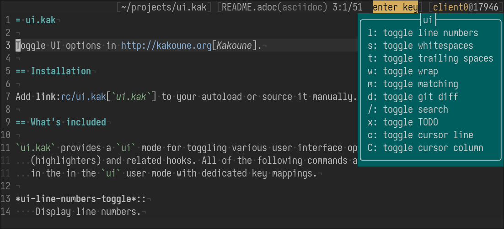

= ui.kak

Toggle UI options in http://kakoune.org[Kakoune].

== Installation

Add link:rc/ui.kak[`ui.kak`] to your autoload or source it manually.

== What's included

* Commands to toggle various user interface options (highlighters) and related hooks;
* A `ui` link:https://github.com/mawww/kakoune/blob/master/doc/pages/modes.asciidoc#user-modes[user mode] with key mappings for all commands.

*ui-line-numbers-toggle* `<l>`::
    Display line numbers.

*ui-whitespaces-toggle* `<s>`::
    Display whitespaces.

*ui-trailing-spaces-toggle* `<t>`::
    Display trailing spaces.

*ui-wrap-toggle* `<w>`::
    Wrap lines to window width.

*ui-matching-toggle* `<m>`::
    Display matching char.

*ui-git-diff-toggle* `<d>`::
    Display https://github.com/mawww/kakoune/blob/master/rc/tools/git.kak[git diff].
    When enabled, this command also adds hooks for automatically updating git diff on `BufWritePost` and `BufReload`. Disabling removes the hooks.

*ui-search-toggle* `</>`::
    Dynamically display search matches using `Search` face.
    When enabled, this command also adds hooks to highlight search matches on `/`,`?`,`*`,`n` and `N` keys.
    Pressing `<esc>` removes the highlights.

*ui-todos-toggle* `<x>`::
    Display `TODO`, `FIXME`, `XXX`, `NOTE` in buffer using `TodoComment` face.

*ui-cursorline-toggle* `<c>`::
    Display current cursor line using `CursorLine` face.

*ui-cursorcolumn-toggle* `<s>`::
    Display current cursor column using `CursorColumn` face.

== Configuration example

The mode can be entered by a `ui` command or by a custom keymapping:

[source,kak]
----
map global user -docstring "UI mode" u ': enter-user-mode ui<ret>'
----

=== Enabling commands on start

To set default options when Kakoune starts, call them in a `WinCreate` hook, for example:

[source,kak]
----
hook global WinCreate .* %{
    ui-line-numbers-toggle
    ui-cursorline-toggle
    ui-trailing-spaces-toggle
    ui-matching-toggle
    ui-search-toggle
}
----

=== Custom parameters

The following options can be changed customize the appearance of some highlighters.

`ui_line_numbers_flags`::
    Custom flags for *ui-line-numbers-toggle*.

`ui_whitespaces_flags`::
    Custom flags for *ui-whitespaces-toggle*.

`ui_wrap_flags`::
    Custom flags for *ui-wrap-toggle*.

Full list of applicable flags can be found https://github.com/mawww/kakoune/blob/master/doc/pages/highlighters.asciidoc#convenient-highlighters[here].

[source,kak]
----
# make lines numbers relative, highlight current line and use empty space for separator
set-option global ui_line_numbers_flags -relative -hlcursor -separator " "

# wrap at 80 chars, at word boundaries and use "..." for marker
set-option global ui_wrap_flags -width 80 -word -marker ...
----
